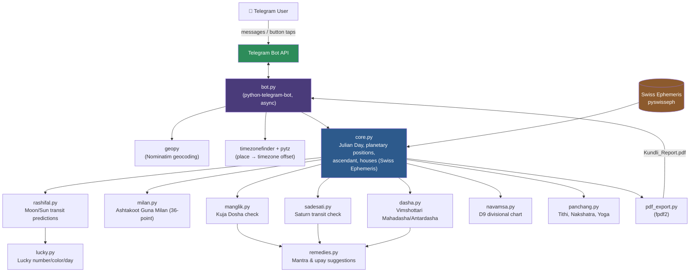
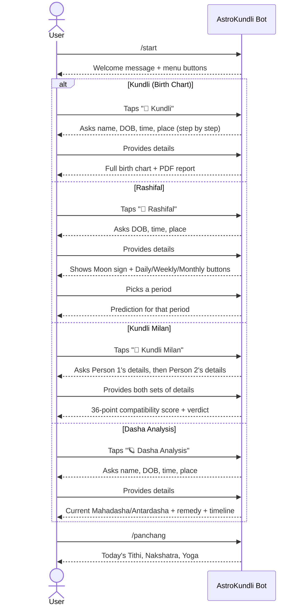

# AstroKundli 🔮

A Telegram bot for accurate Vedic astrology — birth charts, matchmaking, planetary periods, and daily predictions, all calculated from real astronomical data using the Swiss Ephemeris (not templated guesses).

**Bot:** [@AstroKundliBot](https://t.me/AstroKundliBot)

---

## Features

| Feature | Description |
|---|---|
| 🔮 **Kundli (Birth Chart)** | Ascendant, planetary positions, 12 houses (bhavas), retrograde status, Navamsa (D9) chart, Manglik Dosha, Sade Sati, lucky number/color/day, and a downloadable PDF report |
| 🌙 **Rashifal** | Daily, weekly, and monthly predictions based on real-time Moon and Sun transits from your natal Moon sign |
| 💑 **Kundli Milan** | Full Ashtakoot Guna Milan (36-point Vedic compatibility system: Varna, Vashya, Tara, Yoni, Graha Maitri, Gana, Bhakoot, Nadi) plus Manglik cross-check for both partners |
| 🪐 **Dasha Analysis** | Vimshottari Mahadasha and Antardasha timeline, with the current running period highlighted |
| 📅 **Panchang** | Today's Tithi, Nakshatra, Yoga, and Vara (weekday) |
| 🧘 **Remedies** | Classical mantra and upay suggestions tied to Manglik Dosha, Sade Sati, and the current Mahadasha lord |

All calculations use the **Lahiri (Chitrapaksha) ayanamsa**, the standard for Vedic/sidereal astrology.

---

## Architecture



### Tech Stack

- **Language:** Python 3
- **Bot framework:** [python-telegram-bot](https://github.com/python-telegram-bot/python-telegram-bot) v22 (async)
- **Astronomical engine:** [pyswisseph](https://pypi.org/project/pyswisseph/) (Swiss Ephemeris bindings) — the same engine used by professional astrology software
- **Geocoding:** [geopy](https://pypi.org/project/geopy/) (Nominatim)
- **Timezone resolution:** [timezonefinder](https://pypi.org/project/timezonefinder/) + [pytz](https://pypi.org/project/pytz/)
- **PDF generation:** [fpdf2](https://pypi.org/project/fpdf2/)
- **Deployment:** systemd service on AWS EC2 (Ubuntu)

---

## How Users Interact



Every flow collects birth details **once per request** (name → date of birth → time of birth → place of birth), because Vedic astrology calculations are only as accurate as the input: place determines latitude/longitude and timezone, which shift the exact planetary degrees.

---

## Repository Structure

```
astrokundli/
├── bot.py              # Telegram bot: menus, conversation flows, message formatting
├── core.py             # Core engine: Julian Day, planetary positions, ascendant, houses
├── rashifal.py         # Daily/weekly/monthly transit-based predictions
├── milan.py            # Ashtakoot Guna Milan (compatibility matching)
├── dasha.py            # Vimshottari Mahadasha/Antardasha calculation
├── manglik.py          # Manglik (Kuja) Dosha check
├── sadesati.py         # Sade Sati (Saturn transit) check
├── navamsa.py          # Navamsa (D9) divisional chart
├── panchang.py         # Daily Panchang (Tithi, Nakshatra, Yoga)
├── lucky.py            # Lucky number/color/day by Moon sign
├── remedies.py         # Mantra and upay suggestions
├── pdf_export.py       # PDF report generation (fpdf2)
├── requirements.txt    # Python dependencies
├── .env                # BOT_TOKEN (not committed — see .gitignore)
└── .gitignore
```

---

## Step-by-Step Setup

### 1. Clone the repository

```bash
git clone https://github.com/sonujha78/astrokundli.git
cd astrokundli
```

### 2. Create a virtual environment and install dependencies

```bash
python3 -m venv venv
source venv/bin/activate
pip install -r requirements.txt
```

> `pyswisseph` compiles from source on first install — this can take a minute. On a fresh machine, install build tools first: `sudo apt install -y build-essential`.

### 3. Create a Telegram bot

1. Open [@BotFather](https://t.me/BotFather) on Telegram
2. Send `/newbot` and follow the prompts to get a **bot token**
3. Optionally set a profile photo, description, and about text:
   ```
   /setuserpic
   /setdescription
   /setabouttext
   ```

### 4. Configure environment variables

```bash
cat > .env << 'EOF'
BOT_TOKEN=your_actual_bot_token_here
EOF
```

```bash
cat > .gitignore << 'EOF'
venv/
.env
__pycache__/
*.pyc
EOF
```

### 5. Run the bot

```bash
python3 bot.py
```

Open your bot on Telegram and send `/start` to test it.

---

## Deployment (24/7 on a server)

The bot is deployed on a lightweight AWS EC2 instance (Ubuntu, t2/t3.micro — free-tier eligible) using **systemd**, so it runs continuously and restarts automatically on crash or reboot.

### 1. Launch an EC2 instance

- AMI: Ubuntu Server 24.04 LTS
- Instance type: t2.micro / t3.micro
- Security group: allow SSH (port 22)

### 2. SSH in and set up the project

```bash
ssh -i your-key.pem ubuntu@<PUBLIC_IP>

sudo apt update
sudo apt install -y python3-pip python3-venv build-essential git

git clone https://github.com/sonujha78/astrokundli.git
cd astrokundli
python3 -m venv venv
source venv/bin/activate
pip install -r requirements.txt

cat > .env << 'EOF'
BOT_TOKEN=your_actual_bot_token_here
EOF
```

### 3. Create a systemd service

```bash
sudo tee /etc/systemd/system/astrokundli.service > /dev/null << 'EOF'
[Unit]
Description=AstroKundli Telegram Bot
After=network.target

[Service]
Type=simple
User=ubuntu
WorkingDirectory=/home/ubuntu/astrokundli
ExecStart=/home/ubuntu/astrokundli/venv/bin/python3 /home/ubuntu/astrokundli/bot.py
Restart=always
RestartSec=5

[Install]
WantedBy=multi-user.target
EOF
```

### 4. Enable and start the service

```bash
sudo systemctl daemon-reload
sudo systemctl enable astrokundli
sudo systemctl start astrokundli
```

### 5. Check status and logs

```bash
sudo systemctl status astrokundli
sudo journalctl -u astrokundli -f
```

To deploy an update after pushing new code:

```bash
cd ~/astrokundli
git pull origin main
sudo systemctl restart astrokundli
```

---

## Methodology Notes

- **Ayanamsa:** Lahiri (Chitrapaksha) — the Indian government's official standard for sidereal calculations.
- **Rashifal:** Daily/weekly predictions use transit Moon's house position from the natal Moon sign (Chandrabala); monthly predictions use transit Sun's house position.
- **Kundli Milan:** Implements the classical 8-koota (Ashtakoot) system out of a maximum 36 points. Some rare exception rules (e.g. Nadi Dosha cancellation in specific padas) are simplified out for clarity — the core scoring system is fully accurate.
- **Dasha:** Vimshottari Dasha, the most widely used 120-year predictive cycle in Vedic astrology, calculated from the Moon's exact nakshatra position at birth.
- **Manglik Dosha:** Based on Mars's position in houses 1, 2, 4, 7, 8, or 12 from the Ascendant.
- **Sade Sati:** Based on transit Saturn occupying the 12th, 1st, or 2nd house from the natal Moon sign.

---

## License

Apache License 2.0
